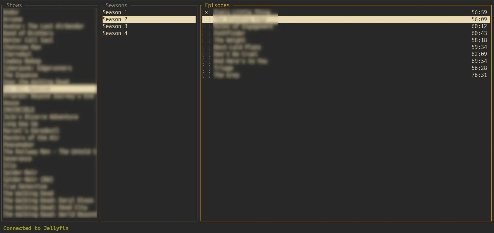

# jellytui

A very opinionated *Shows*-only TUI for [Jellyfin].

## Features

- 3-pane layout showing `Shows > Seasons > Episodes`, you can navigate this with your arrow keys
- each episode displays its runtime in `mins:secs`
- ability to spawn an mpv player for watching the selected episode by pressing `s`. ~~Upon closing mpv, the point where
  you left off is saved on your jellyfin server so you can resume~~ Every 15 seconds your watch progress is updated on your jellyfin server.
- mark episode as watched/unwatched manually with `space` (if you've watched most of it, jellyfin should mark it as watched automatically)
- force refresh a show's cache with `r`

### The Caching Mechanism

> [!NOTE]
> The cache is stored in
> - linux: ~/.local/share/jellytui/state.json
> - windows: ~/AppData/Roaming/jellytui/jellytui/data

In order to not bomb my server with requests, I tried minimizing network interactions.

- when you launch the TUI, all the data you see immediately displayed is pulled from the cache (in subsequent runs of course).
- when you launch the TUI, all the show names are fetched (the left pane)
  - since the first show is selected by default, this is also fetched here
- as you scroll down each show, that specific show is fetched. This is done only **once** per run to limit the amount of requests.
  The idea here being that you probably won't be updating the shows that much *while* watching them but if you are you can force
  reload the specific show with `r`
- when you exit, the data will be saved in the cache file

This makes it so everything on screen is by default only fetched once.

## Environment Variables

You can see what's needed in [`.example.env`](./.example.env). Either create a `.env` file or pass these as arguments.

- `JELLYFIN_URL`: Should look something like this `http://192.168.0.63:8096`
- `JELLYFIN_API_KEY`: Open any episode and click `More > Copy stream URL`. At the end of the link you should see `?api_key=...`, paste that here.
- `JELLYFIN_USER_ID`: Go to your profile and paste your `?userId=...`

## State of the Project

I mean it works obviously but as I said earlier, this was made specifically to suit me and not to be the best looking or most functional or most
configurable for any user. I likely won't take feature requests, maybe bug reports (unless its something important), I encourage you to take
the code and make it your own if you want to :)

## A Disclaimer on AI Use

I recently realized I had access to Gemini Pro via my university and wanted to see how relying on an LLM for programming is. As a result maybe 90% of
the code here is AI generated. Can't say I was a big fan and likely won't lean on LLMs to this degree again in the future. Might write a short
blog post about this at some point.

[Jellyfin]: https://jellyfin.org
